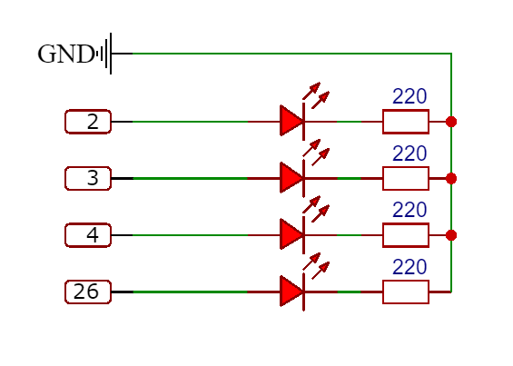

# Harlow Bindicator

<div align="center">
  
  [](https://github.com/joseph-mccarthy/harlow-bindicator/blob/main/LICENSE)
  [](https://wakatime.com/badge/github/joseph-mccarthy/harlow-bindicator)

</div>

A simple Raspberry Pi project that checks the [__Harlow Council__](https://www.harlow.gov.uk/) website for the bin collection day and bin type of a given property. If the current day is bin day then light up the correct LED for the given bin type.

## Problem

I'm always forgetting when bin day is, and when bin day comes it's always a panic to get the bin out. This also includes looking out the window to see what bin the neighbours have put out to make sure that I put the same one out. So I looked for a solution and came across [__this__](https://twitter.com/tarbard/status/1002464120447397888) by [__Darren Tar__](https://twitter.com/tarbard), it's awesome.

However, I don't live in Glasgow, so I checked to see if Harlow had a nice API, and my luck kicked in, no they didn't.

### Harlow Council

They had some horrific embedded thing. Their implementation took firstly a postcode, done a lookup, then asked for a door number and street. This then rendered another webpage with embedded js to gather the results. However I noticed that there was a since parameter on the final rendered page a [__UPRN__](https://www.geoplace.co.uk/addresses-streets/location-data/the-uprn). To Google! Turns out this identifies a single property.

## Hardware

Below is a simplified wiring diagram for the LED's and resistors to have light output from the Harlow Bindicator. The Ground is connected to the Raspberry Pi __3.3__ Volt Ground. While the activity LED is connected to Pin __26__. The Bin Day LED is connected to Pin __2__. The Recycling Bin LED is connected to Pin __3__ and the Landfill Bin LED is connected to Pin __4__. If you don't want to have a flashing LED to indicate that the script is running, then just don't wire in the Activity LED.



_note: The food waste caddy has not been wired in as every week this is collected regardless of the wheelie bin being collected._

## Required Binaries

Before running this script on a Raspberry Pi, there are a few steps to complete. Firstly you'll need to install a chromium browser as well as a chrome web driver for selium to use.

On the Raspberry Pi terminal run the following:

```bash
sudo apt-get update
sudo apt-get install chromium-browser
sudo apt-get install chromuim-chromedriver
```

Running the above will update the distribution lists, then install the chromium browser and then the correct chrome driver. To ensure that the above steps have completed enter the following and check that both __chromediver__ and __chromium_browser__ are present.

```bash
cd /usr/bin
ls -l chrom*
```

## Setting Up Harlow Bindicator

Firstly clone down the repository to the desired location on your Raspberry Pi.

```bash
git clone https://github.com/joseph-mccarthy/harlow-bindicator.git
cd harlow-bindicator
```

Create a Python virtual environment for the script to run within. Then activate the environment and install the required packages for the Harlow Bindicator Script.

```bash
python -m venv .venv
source .venv/bin/activate
pip3 install -r requirements.txt
```

## Running Harlow Bindicator

The Raspberry Pi is now configured and ready to start running the Harlow Bindicator and making your bin day easier. There is just one final parameter that's needed for the script which is personal to you. This is the __UPRN__ (_Unique Property Reference Number_), this is needed for the script in order to work out when bin day is for an address. If this makes you feel uncomfortable, feel free to put in the the UPRN for someone at least in your street.

### Finding your UPRN

In order to find the UPRN for your property there is a rather helpful website [__findmyaddress.co.uk__](https://www.findmyaddress.co.uk/search) which I used to find mine based on street name and door number. Once you have got the UPRN make a note of it and keep it to one side.

### Starting Harlow Bindicator

You're now ready to run the Harlow Bindicator Script, by entering the following command.

```bash
python harlow-bindicator/main.py --uprn YOUR_UPRN
```

You should now start seeing output from the script to confirm that it's active. If you also followed the hardware guide, the activity light should also be flashing.

## License

Copyright (c) 2022 Joseph McCarthy

Permission is hereby granted, free of charge, to any person obtaining a copy
of this software and associated documentation files (the "Software"), to deal
in the Software without restriction, including without limitation the rights
to use, copy, modify, merge, publish, distribute, sublicense, and/or sell
copies of the Software, and to permit persons to whom the Software is
furnished to do so, subject to the following conditions:

The above copyright notice and this permission notice shall be included in all
copies or substantial portions of the Software.

THE SOFTWARE IS PROVIDED "AS IS", WITHOUT WARRANTY OF ANY KIND,
EXPRESS OR IMPLIED, INCLUDING BUT NOT LIMITED TO THE WARRANTIES OF
MERCHANTABILITY, FITNESS FOR A PARTICULAR PURPOSE AND NONINFRINGEMENT.
IN NO EVENT SHALL THE AUTHORS OR COPYRIGHT HOLDERS BE LIABLE FOR ANY CLAIM,
DAMAGES OR OTHER LIABILITY, WHETHER IN AN ACTION OF CONTRACT, TORT OR
OTHERWISE, ARISING FROM, OUT OF OR IN CONNECTION WITH THE SOFTWARE OR THE USE
OR OTHER DEALINGS IN THE SOFTWARE.

## Author Info

* [GitHub](https://github.com/joseph-mccarthy)
* [Website](https://joseph-mccarthy.github.io/)

[Back To The Top](#harlow-bindicator)
